# 👨‍👩‍👦‍👦 Simple Community 👨‍👩‍👦‍👦 

[](https://ko.vuejs.org/)
[](https://nodejs.org/en)
[](https://www.mysql.com/downloads/)

> 커뮤니티 사이트 👉 

## 📖 개요

심플한 게시판

친구들, 동료들과 함께 링크를 공유하여 글을 작성

댓글 작성과 좋아요

<div>
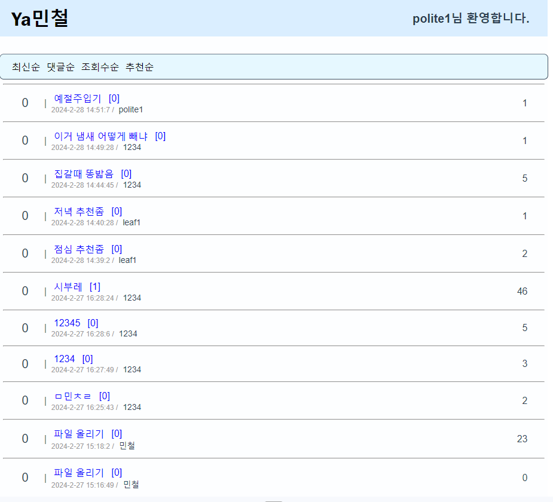
</div>

## 📖 목표

- 전체 아키텍처 구성
- Vue.js 와 node.js 학습
- 프로젝트 일정에 맞게 완성
- 모든 메인 기능 구현

## 🔧 Stack
- **Language**: JavaScript
- **Library & Framework** : Vue.js & Node.js
- **Database** : MYSQL
- **ORM** : Sequelize

## ⭐ 메인 기능
### 게시판 기능
- 게시글 작성
- 게시글 수정
- 게시글 삭제
- 게시글 검색(제목, 작성자)
- 페이지 이동 <이전 1, 2, 3 … 다음>
- 좋아요(추천)
- 게시글 정렬(최신순, 댓글순, 조회수순, 추천순)
- 인기글 (추천 10개이상)

### 댓글 기능
- 댓글 작성
- 댓글 삭제

### 로그인 & 회원가입 기능

## 👨‍💻 프로젝트 일정
### UI 구현
|작업|일정|진행|
|---|---|---|
|상단바|2024.02.02 까지|O|
|메인화면|2024.02.08 까지|O|
|로그인화면|2024.02.08 까지|O|
|회원가입화면|2024.02.08 까지|O|
|상세 게시글 화면|2024.02.15 까지|O|
|댓글|2024.02.15 까지|O|
|게시글 작성|2024.02.15 까지|O|
|게시글 수정|2024.02.15 까지|O|
|디자인 전체 보완|2024.02.25 까지|O|

### 기능 구현
|작업|일정|진행|
|---|---|---|
|라우팅(화면이동)|2024.02.08 까지|O|
|멀티미디어 파일|2024.02.24 까지|O|
|페이지 번호|2024.02.24 까지|O|
|게시글 검색|2024.02.20 까지|O|
|게시글 정렬|2024.02.20 까지|O|
|추천 기능|2024.02.20 까지|O|

### 연동 구현
|작업|일정|진행|
|---|---|---|
|백엔드 연동|2024.02.20 까지|O|

### DB 구현
|작업|일정|진행|
|---|---|---|
|테이블 설계|2024.02.01 까지|O|
|테이블 구현|2024.02.07 까지|O|
|서버 연동|2024.02.07 까지|O|

### API 구현
|작업|일정|진행|
|---|---|---|
|로그인|2024.02.06 까지|O|
|회원가입|2024.02.06 까지|O|
|ID 중복 체크|2024.02.06 까지|O|
|email 중복 체크|2024.02.06 까지|O|
|게시글 리스트 가져오기|2024.02.06 까지|O|
|상세 게시글 리스트 가져오기|2024.02.07 까지|O|
|댓글 리스트 가져오기|2024.02.08 까지|O|
|게시글 등록|2024.02.10 까지|O|
|게시글 수정|2024.02.10 까지|O|
|게시글 삭제|2024.02.10 까지|O|
|댓글 등록|2024.02.13 까지|O|
|댓글 삭제|2024.02.13 까지|O|
|좋아요(추천)|2024.02.15 까지|O|

### 테스트 및 빌드 배포
|작업|일정|진행|
|---|---|---|
|통합 테스트|2024.02.25 까지|O|

## ⚒ API 명세서
### API 구현
|REST API|설명|URL|
|---|---|---|
|POST|게시글 작성|/content|
|PUT|게시글 수정|/content/{/content_id}|
|DELETE|게시글 삭제|/content/{/content_id}|
|GET|게시글 정보 받아오기|/content/{/content_id}|
|GET|게시글 리스트 받아오기(검색,정렬,인기글)|/content/list|
|GET|댓글 리스트 받아오기|/content/list/{content_id}|
|POST|댓글 작성|/comment|
|DELETE|댓글 삭제|/comment/{comment_id}|
|POST|좋아요|/like/{content_id}|
|GET|로그인|/login|
|POST|회원가입|/sign|
|GET|ID 중복 체크|/id-check|
|GET|email 중복 체크|/email-check|

## :open_file_folder: Project Structure

```markdown
simple_community
├── backend
|   ├── config
│   ├── build
│   ├── models
│   └── public
│   └── routes
├── frontend
│   ├── public
│   └── src
│       └── assets
│       └── components
│       └── router
│       └── views
```

## :baby_chick: image

<div float="left">
    
    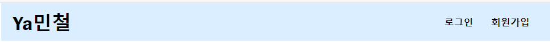
    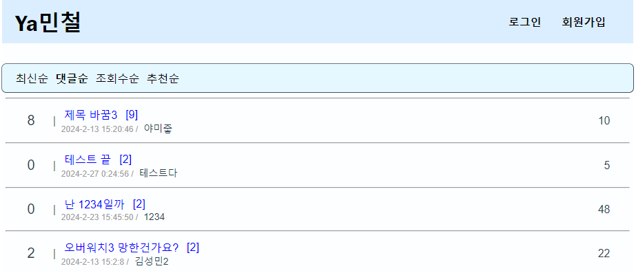
    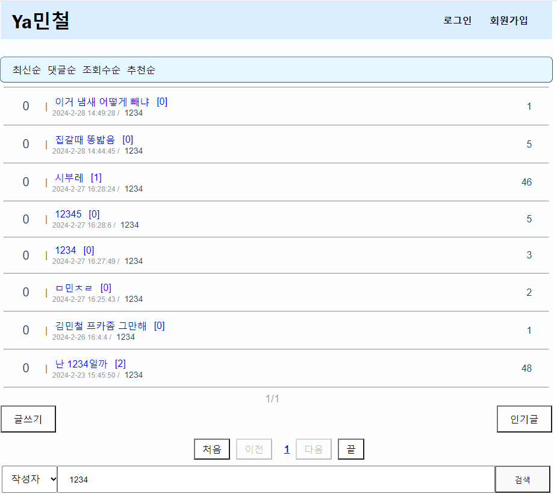
    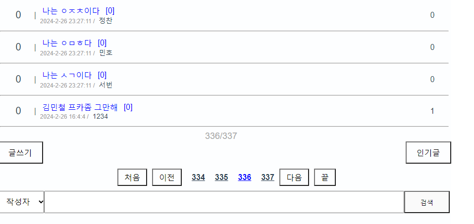
    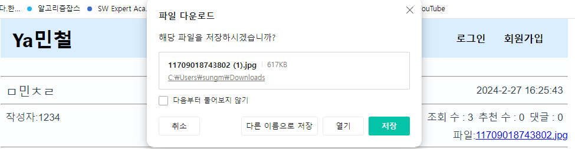
    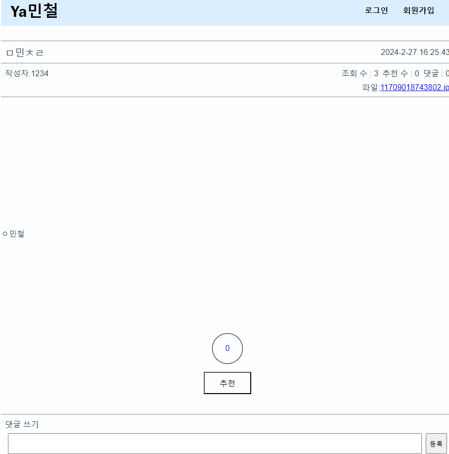
    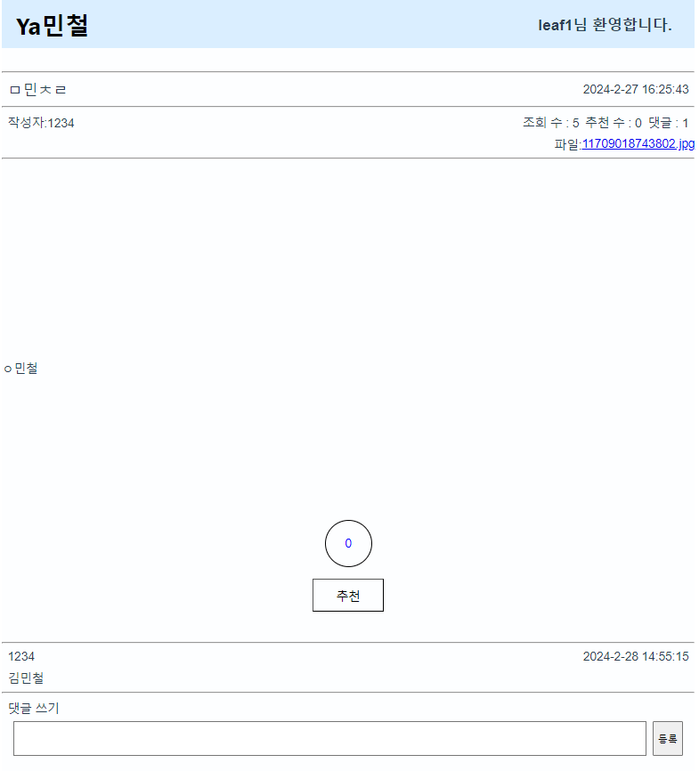
    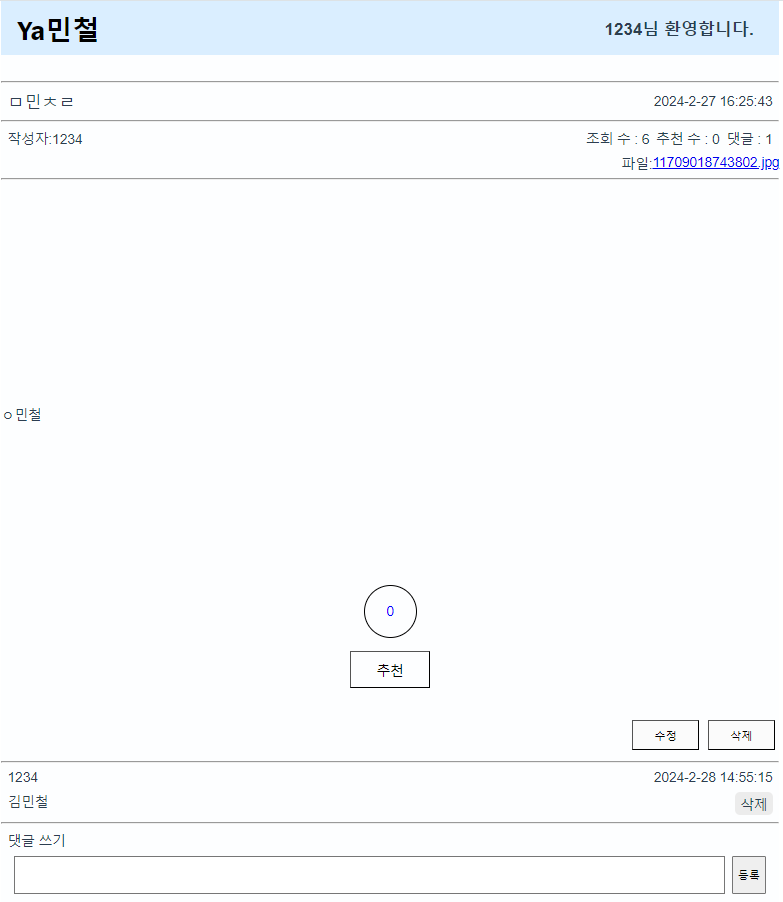
    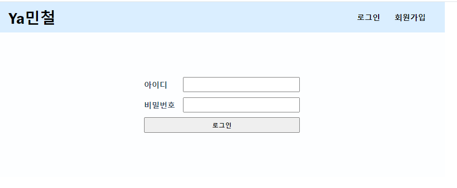
    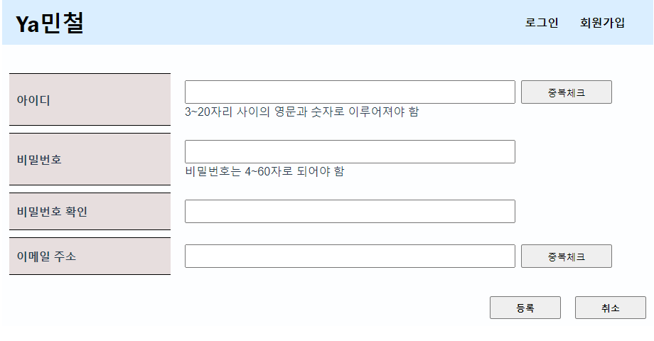
</div>

## 👨‍👩‍👧‍👦 Developer
*  **김성민** ([leafeafeaf](https://github.com/leafeafeaf))
*  **박지훈** ([dispear](https://github.com/dispear))

